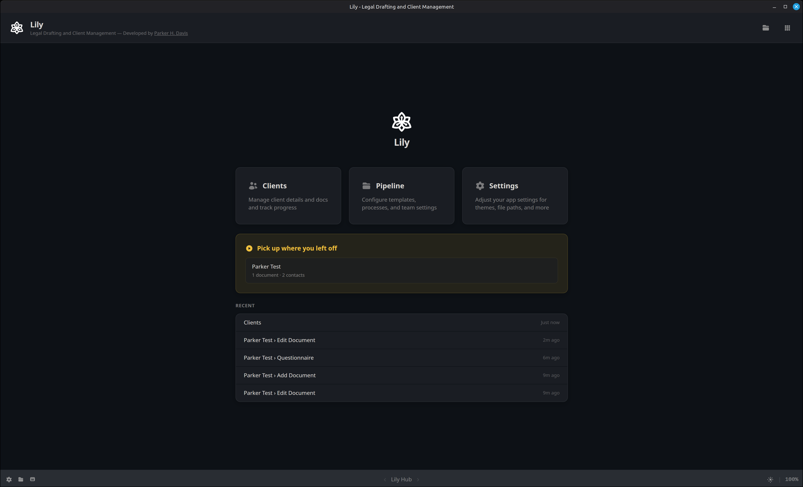
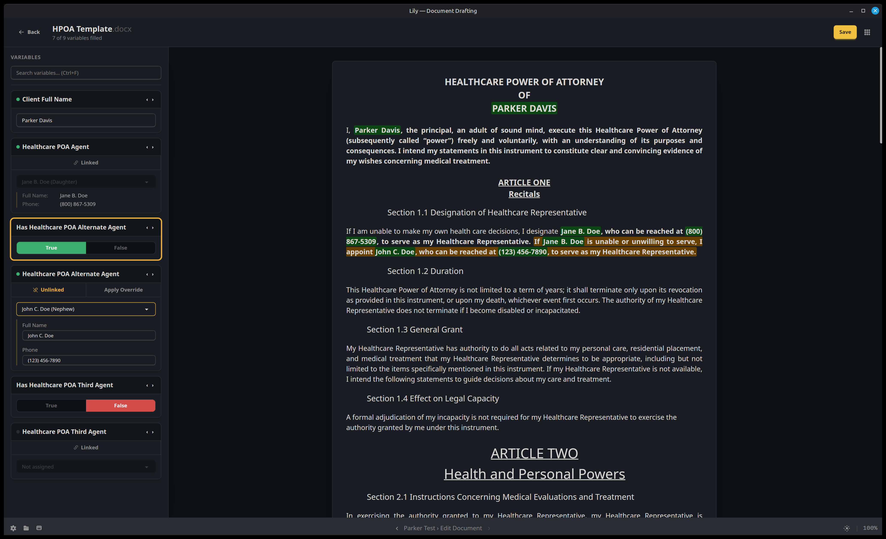

# Lily

Legal document drafting and client info management toolset, created custom for an estate-planning law firm.

Lily streamlines the process of gathering client information and using it to populate initial drafts of client documents derived from Word documents (.docx/.dotx) templated with a custom syntax, which legal professionals can then polish and supervise to execution. Users select a working directory (typically a client folder), choose a template, and fill in variables; Lily handles copying, previewing, and saving the completed document, which can be edited like any normal Word document and re-opened at any time to adjust variables.




*Screenshot from v0.3.0 dev build 2026-03-25*


## Stack
- **Runtime / Package Manager:** Bun
- **Desktop Framework:** Tauri 2 (Rust backend)
- **Frontend:** React + TypeScript
- **Styling:** Tailwind CSS + daisyUI


## Workflow



*Screenshot from v0.3.0 dev build 2026-03-25*

### Client Management
- Configure one or more **client library directories** to browse all clients from the Clients Hub
- Or open any folder directly — Lily creates a `.lily` project file to track client data
- **Questionnaire-based intake** walks through structured sections (organized by tabs) to gather client info upfront
- **Contacts** can be added and assigned to roles (e.g., "Healthcare POA Agent"); their properties auto-fill across documents via `{Role.property}` syntax

### Document Drafting
1. Choose a template (`.docx` / `.dotx`) from the configured templates folder
2. A copy is placed in the client folder — the original is never modified
3. Fill in variables via the sidebar form — the preview updates live
4. Variables are **shared across all documents** for the same client — fill in `{Client Full Name}` once and it carries over everywhere

### Variable Types
- **Replacement** — `{Variable Name}` with case-aware substitution (ALL CAPS, Title Case, lowercase)
- **Conditional** — `{Label ?? "true text" :: "false text"}` controlled by a toggle
- **Contact-role** — `{Role.property}` auto-filled from assigned contacts

### Save and Track
- **Autosave** writes changes after a 2-second pause (or manual `Ctrl+S`)
- Track documents through statuses: Not Started → Drafting → Reviewing → Complete → Executed
- Create **dated versions** of documents to preserve history
- The completed `.docx` is a standard Word file, ready for editing in any word processor


## Development

```bash
# Install dependencies
make setup

# Run in development mode
make dev

# Build for production
make build
```


## License

Covered under the GPL License, see [LICENSE](./LICENSE.md)

Beyond that, I only have one rule: **First, do no harm. Then, help where you can.**


## Financial Support

If you have some cash to spare and are inspired to share, that's very kind. Rather than sharing that kindness with me, I encourage you to share it with your charity of choice. 

Mine is the [GiveWell top charities fund](https://www.givewell.org/top-charities-fund) , which does excellent research to figure out which causes can save the most human lives for the money, and put their funds there.

Their grant to the [Against Malaria Foundation](https://www.againstmalaria.com) was shown to deliver outcomes at a cost of just $1,700 per life saved.


